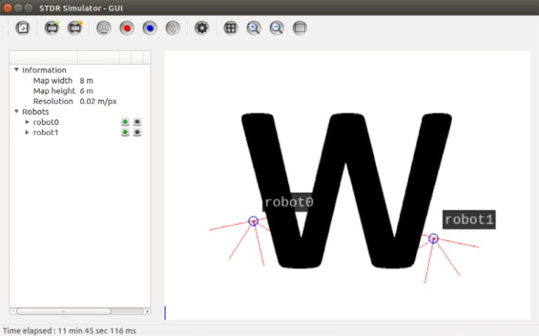

# Wall Follower - A Simple Reactive Robot

  

In this project you'll find a robot that can follow a wall.

It was developed using ROS and STDR Simulator.

It was designed to analyse the laser sensors it has and keep track of the wall.

It was tested using a 'W' shaped map, both on the inside and outside walls.

## Project Dependencies
This project was developed under Ubuntu 16.04 with ROS Kinetic, compatibility with older or newer versions is not guaranteed.

The project requires the following dependencies installed:

* ROS Kinetic and proper build tools installed
* A properly configured catkin workspace
* The STDR simulator packages installed in ROS
* A Python interpreter, version 2.7 or equivalent/compatible

## How to run this project
### Installing the packages
1. Copy the directory containing this code into your catkin workspace's _src_ folder to create a package for this project.
2. Open a terminal at the root of your catking workspace and run `catkin_make` to compile.

### Launching the Server, GUI, Map and spawning robots:
Open a terminal and run the `roslaunch <package_name> <launcher>` command:

-  `<package_name>` - replace with the package name of this project.
-  `<launcher>` - replace with one of the provided launchers.

**For example:** `roslaunch wall_follower server_with_map_gui_and_2_simplex.launch`

### Launching the AI nodes of each robot
Open a terminal for each robot spawned and launch the nodes with the following command: `rosrun wall_follower avoid_wall.py <id>`

Replace `<id>` with the respective id of the robot you wish to control.

**For example:** `rosrun wall_follower avoid_wall.py 0`
**Or:** `python avoid_wall.py 1`
